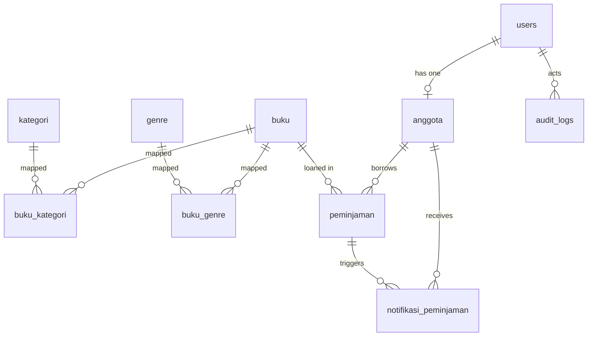

# ERD Sistem Perpustakaan (Pustaka40)

Dokumen ini dipakai sebagai tugas analisis sebelum coding.

## Entitas dan Atribut Inti

1. `users`
   - `id` (PK)
   - `name`
   - `email` (unique)
   - `password`
   - `role` (`admin` / `anggota`)
   - `deleted_at`

2. `anggota`
   - `id` (PK)
   - `user_id` (FK -> users.id, unique, nullable)
   - `nis` (unique)
   - `nama`
   - `kelas`
   - `no_hp`
   - `alamat`
   - `deleted_at`

3. `buku`
   - `id` (PK)
   - `judul`
   - `pengarang`
   - `tahun_terbit`
   - `stok`
   - `deleted_at`

4. `kategori`
   - `id` (PK)
   - `nama_kategori` (unique)
   - `deskripsi`
   - `deleted_at`
   - Catatan bisnis: kategori dipakai sebagai klasifikasi level-1 (`Fiksi` / `Nonfiksi`).

5. `buku_kategori` (pivot)
   - `buku_id` (FK -> buku.id)
   - `kategori_id` (FK -> kategori.id)
   - Catatan bisnis: setiap buku dipetakan ke 1 kategori aktif.

6. `genre`
   - `id` (PK)
   - `nama_genre` (unique)
   - `deskripsi`
   - `deleted_at`

7. `buku_genre` (pivot)
   - `buku_id` (FK -> buku.id)
   - `genre_id` (FK -> genre.id)
   - unique (`buku_id`, `genre_id`)

8. `peminjaman`
   - `id` (PK)
   - `anggota_id` (FK -> anggota.id)
   - `buku_id` (FK -> buku.id)
   - `tgl_pinjam`
   - `tgl_kembali_rencana`
   - `tgl_kembali_aktual`
   - `status` (`menunggu_acc` / `dipinjam` / `dikembalikan` / `ditolak`)
   - `denda`
   - `denda_dibayar`
   - `tgl_bayar_denda`
   - `catatan_denda`
   - `deleted_at`

9. `notifikasi_peminjaman`
   - `id` (PK)
   - `anggota_id` (FK -> anggota.id)
   - `peminjaman_id` (FK -> peminjaman.id)
   - `jenis` (`jatuh_tempo` / `terlambat`)
   - `pesan`
   - `tanggal_notifikasi`
   - `dibaca_pada`

10. `audit_logs`
   - `id` (PK)
   - `user_id` (FK -> users.id, nullable)
   - `aksi`
   - `entitas`
   - `entitas_id`
   - `data_lama` (json)
   - `data_baru` (json)
   - `ip_address`
   - `user_agent`

## Diagram ERD (Mermaid)

## Keputusan Desain Database

1. `users` dipisah dari `anggota` agar admin tidak wajib punya profil anggota.
2. Klasifikasi buku dipisah jadi dua level:
   - `kategori` untuk kelas utama (`Fiksi` / `Nonfiksi`),
   - `genre` untuk pengelompokan detail (mis. Novel, Sejarah, Teknologi).
3. Alur peminjaman memakai approval admin melalui status `menunggu_acc` -> `dipinjam` atau `ditolak`.
4. Denda disimpan langsung di `peminjaman` untuk histori tetap konsisten walau aturan denda berubah di masa depan.
5. Soft delete dipakai di entitas operasional agar data arsip tetap bisa dipulihkan.
6. Audit log menyimpan snapshot sebelum/sesudah perubahan agar pelacakan aktivitas lebih jelas.
